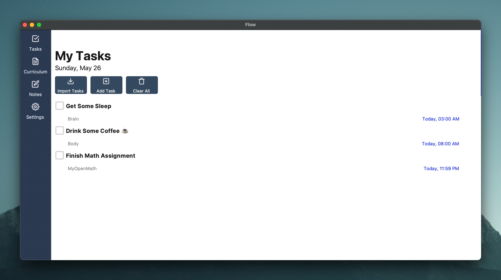

# Flow

## TO-DO Manager X Classwork Organizer

### Key Features:

#### 1. To-Do List Management:

- Create, edit, and delete tasks.
- Set due dates and times for tasks. 
- Categorize tasks by subject or priority.
- Mark tasks as completed.
- File Organization:

#### 2. Notifications:

- Receive reminders for upcoming tasks and due dates.

### 3. User-Friendly Interface:

- Intuitive design tailored for students.
- Easy navigation between tasks and files.

Upload and organize files related to different subjects or projects.




# Setup
Setting up Flow is easy! Run the following commands.
1. Clone the repo.
2. Use pip to install the packages.
```shell
pip install -r requirements.txt
```  
3. Run the file.
```shell
python main.py
```

## Importing tasks from blackboard

### Getting the iCalendar URL
To get the iCalendar URL you have to login to blackboard and follow the next steps.


* Click on your name (indicated by the black box)

---


* Next click on the calendar icon indicated by the yellow box.

---


* Scroll down till you see this button.
* Click on it to get your iCalendar URL.
* Copy the url and paste it into import tasks button and click 'Save URL'.


